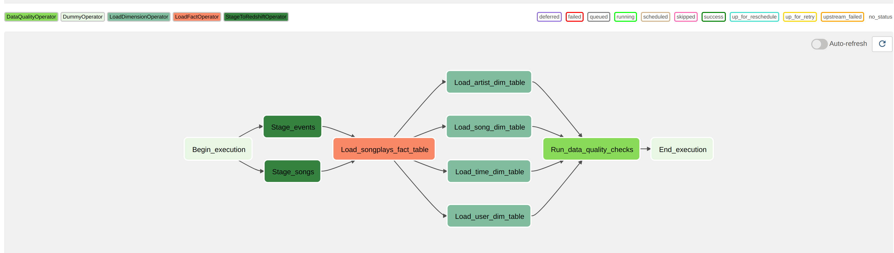
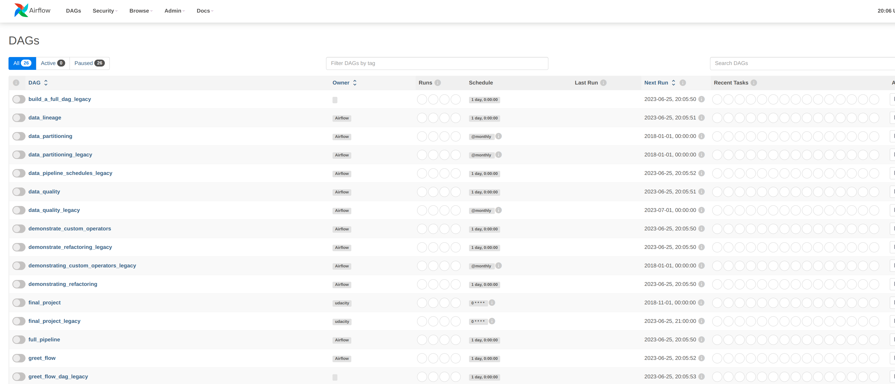

# Data Pipelines with Airflow
A music streaming company, Sparkify, has decided that it is time to introduce more automation and monitoring to their data warehouse ETL pipelines and come to the conclusion that the best tool to achieve this is Apache Airflow.

They have decided to bring you into the project and expect you to create high grade data pipelines that are dynamic and built from reusable tasks, can be monitored, and allow easy backfills. They have also noted that the data quality plays a big part when analyses are executed on top the data warehouse and want to run tests against their datasets after the ETL steps have been executed to catch any discrepancies in the datasets.

The source data resides in S3 and needs to be processed in Sparkify's data warehouse in Amazon Redshift. The source datasets consist of JSON logs that tell about user activity in the application and JSON metadata about the songs the users listen to.


# Content

## My DAG




## Data quality checks

The intention to perform the data quality checks in this fashion is with the goal of making the testing more general. 

Copying the general idea of great expectations with this kind of test, we want to execute querys, and see if we can find results that are not compliant with the test. So for example, if we want to guarantee not null values for a column, we will perform a query to search for null values. If te query returns a null greater that x (being x our aceptable threshold) it will thrown an error. 

There is general case, and this is when we wanna count rows. In that case, we write a flag in our test to just count, and guaranteed we have loaded at least an x number of rows. 

```
for test in self.tests:
            expected = test['expected']
            type = test.get('type', 'general')
            sql = test['sql']
            self.log.info(f'Get records for query: "{sql}"')
            records = postgres.get_records(sql)
            num_records = records[0][0]

            if type == 'count' and num_records < expected:
                raise ValueError(f"Data quality check failed.\
                    The sql query {test.sql_query} returned\
                        the following results {records}")
                
            elif num_records >= expected:
                raise ValueError(f"Data quality check failed.\
                     The sql query {test.sql_query} returned\
                          the following results {records}")

```

Below is an example of how we perform a check where we want to guarantee that not **userid** is null. If the test finds that a user id is null it will raise an exception making the task fail.
```
{
            'description': 'Table is not empty',
            'table': 'staging_events',
            'sql' : 'SELECT  count(*) FROM staging_events where userid is null',
            'expected' : 1,
            'type' : 'general'
        }
```

Here is a example of how we can perform a test to guarantee that at least we have loaded 1 column.
```
{
            "description": "Table is not empty",
            "table": "staging_events",
            "sql": "SELECT count(*) FROM staging_events",
            "expected": 1,
            "type": "count"
}
```
